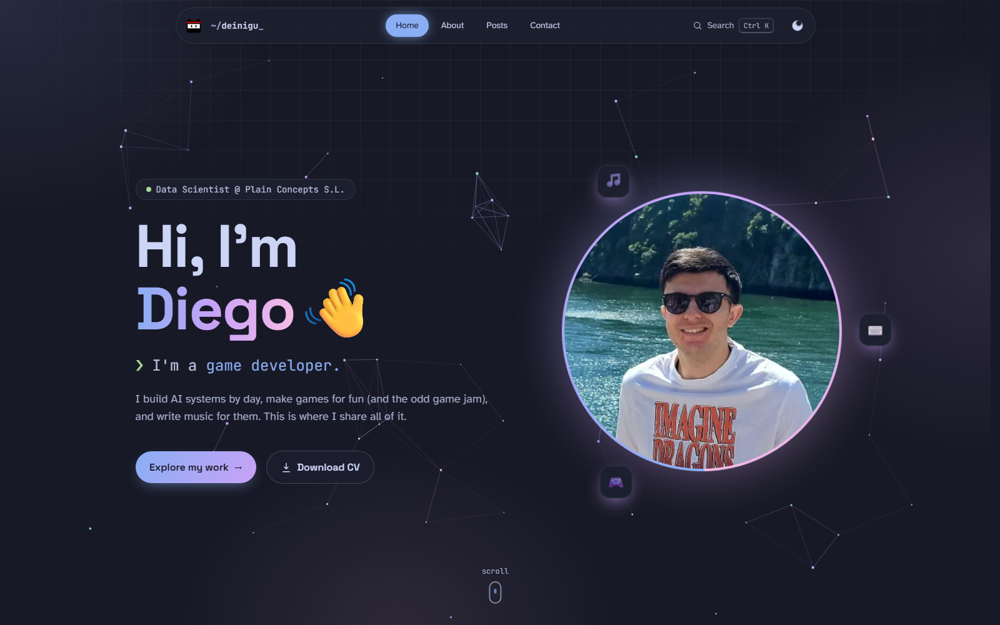

# Portfolio - Deinigu

My personal portfolio and blog, where I write about my projects, games and music. Built with Astro and TailwindCSS.

**Live site:** [deinigu.github.io/portfolio](https://deinigu.github.io/portfolio)



## Table of Contents

- [Features](#features)
- [Tech Stack](#tech-stack)
- [Getting Started](#getting-started)
- [Scripts](#scripts)
- [Adding Content](#adding-content)
- [Folder Structure](#folder-structure)
- [Deployment](#deployment)
- [License](#license)

## Features

- **Interactive hero:** particle network that reacts to the cursor, text scramble and typewriter effects
- **Three worlds:** dedicated sections for projects, games and music, each with its own animated preview
- **Command palette:** press `Ctrl` + `K` (or `/`) to search posts, jump between pages and run actions
- **Light & dark themes:** Catppuccin palette with a circular reveal when switching themes
- **Blog posts:** reading time, table of contents with active section tracking, previous/next navigation and copy buttons on code blocks
- **Fast navigation:** pages are prefetched (and prerendered in Chromium browsers) before you click
- **Scroll animations:** progressive enhancement with CSS scroll-driven animations, respecting reduced motion settings
- **Easter egg:** try the Konami code ↑ ↑ ↓ ↓ ← → ← → B A
- **SEO ready:** sitemap, RSS feed and Open Graph metadata

## Tech Stack

- **Framework:** [Astro](https://astro.build/)
- **Styling:** TailwindCSS, Tailwind Typography, [Catppuccin](https://catppuccin.com/) colors
- **Markdown:** MDX with Shiki syntax highlighting
- **Animations:** CSS scroll-driven animations, View Transitions API (theme toggle), Canvas 2D
- **Fonts:** Space Grotesk, JetBrains Mono, Atkinson Hyperlegible
- **Build Tools:** Vite
- **Other:** Astro RSS, Astro Sitemap, Astro Embed, Formspree (contact form)

## Getting Started

### Prerequisites

- Node.js >= 22.22
- npm

### Installation

```bash
git clone https://github.com/Deinigu/portfolio.git
cd portfolio
npm install
```

### Development

```bash
npm run dev
```

Open [http://localhost:4321/portfolio](http://localhost:4321/portfolio) in your browser.

### Production Build

```bash
npm run build
npm run preview
```

> The dev server is noticeably slower than the real site. Use `build` + `preview` to judge performance.

## Scripts

- `dev` – Run project in development mode
- `build` – Build project for production
- `preview` – Preview production build locally
- `astro` – Run Astro CLI commands

## Adding Content

### Posts

Posts live in `src/content/posts/`, split into three collections: `projects/`, `games/` and `music/`. Add a `.md` or `.mdx` file with this frontmatter:

```yaml
---
title: "My New Project"
description: "A short summary shown on cards and in search."
pubDate: "2025-01-31"
heroImage: "../../../assets/images/projects/my-project/cover.png"
collection: "projects"
tags: ["Python", "AI"]
sourceCode: "https://github.com/Deinigu/my-project" # optional
---
```

New posts automatically appear on the home page, in the posts list, in the command palette and in the RSS feed.

### Skills, certifications and career

Edit `src/consts.ts`:

- `skills` – technologies shown on the About page and in the home page marquee
- `certifications` – certification cards
- `careerItems` – career timeline (the first item is shown as the current role in the hero)
- `socialLinks` – social media links

Local icons go in `public/icons/` and are referenced as `/portfolio/icons/<file>`.

## Folder Structure

```text
portfolio/
├─ astro.config.mjs         # Astro configuration (prefetch, markdown, integrations)
├─ package.json
├─ package-lock.json
├─ tsconfig.json
├─ public/                  # Static assets
│  ├─ favicon.svg
│  ├─ fonts/
│  ├─ icons/                # Local technology icons
│  ├─ itchio.svg
│  ├─ logo.png
│  └─ pdf/                  # CV
├─ src/
│  ├─ assets/               # Images, icons, media
│  ├─ components/           # Astro components
│  ├─ consts.ts             # Site data: skills, certifications, career, socials
│  ├─ content/              # Markdown/MDX posts
│  ├─ content.config.ts     # Content collections
│  ├─ layouts/              # Base and blog post layouts
│  ├─ pages/                # Routes (home, about, posts, contact, 404, RSS)
│  ├─ scripts/              # Shared helpers for posts
│  └─ styles/               # Tailwind and global styles
└─ README.md
```

## Deployment

The site is deployed to GitHub Pages by the [Deploy Astro site to Pages](.github/workflows/astro.yml) workflow on every push to `main`.

## License

This project is licensed under the MIT License. See [LICENSE](LICENSE) for details.
