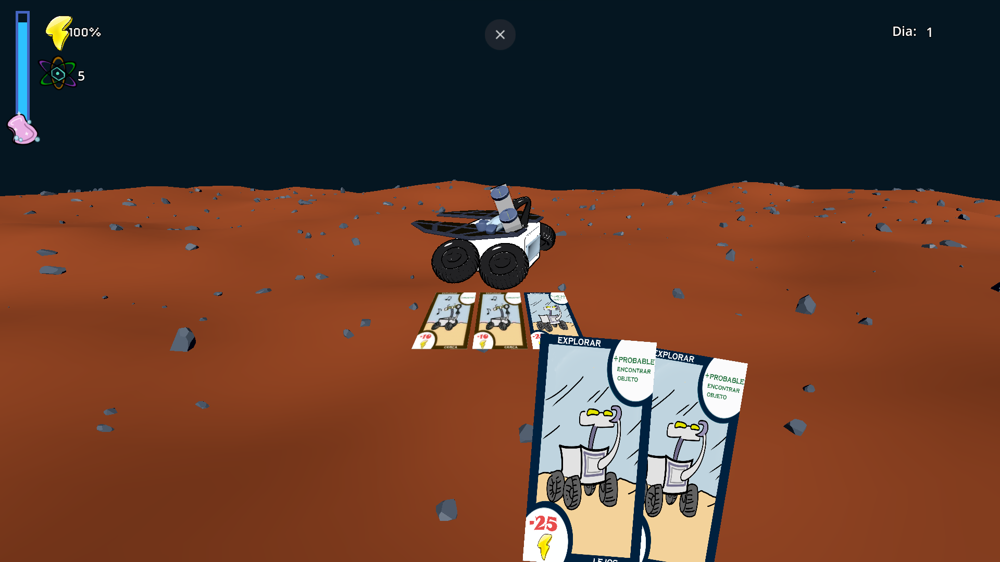
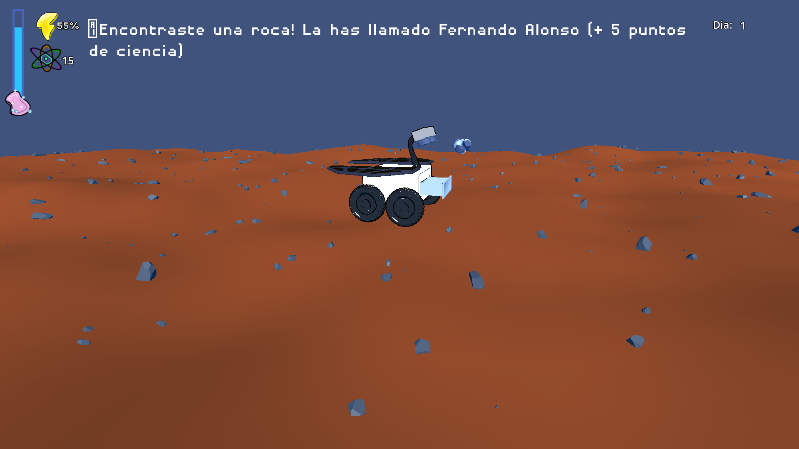

## About the Game

After Dark: Mars Mission is a resource-management card game where you guide Roberto, the Rover, across the mysterious Martian landscape. Created for the Indie Spain Jam 2023, the game challenges players to survive the harsh environment of Mars while discovering lots of secrets (rocks). Every rock has a name!

### [🎮 Play After Dark: Mars Mission on itch.io](https://katpuccinox.itch.io/after-dark-mars-mission).

---

## 🦾 Credits

Roberto the Rover was possible thanks to the help of this marvelous team:

- [Lucas Colbert Eastgate](https://www.linkedin.com/in/lucas-colbert-eastgate-140a911b3/)
- [Alba Sánchez Ibañez](https://www.linkedin.com/in/alba-s-093242259/)
- [J. Ricardo Sánchez Ibáñez](https://www.linkedin.com/in/jricardosi/)

Be sure to check out this animation video by J. Ricardo!

    <iframe
        src="https://www.youtube.com/embed/JQpDgyDOAT0"
        title="After Dark: Mars Mission Animation by J. Ricardo"
        allow="accelerometer; autoplay; clipboard-write; encrypted-media; gyroscope; picture-in-picture"
        allowfullscreen
        class="rounded-lg shadow-lg h-100 w-full"
    >
    </iframe>

