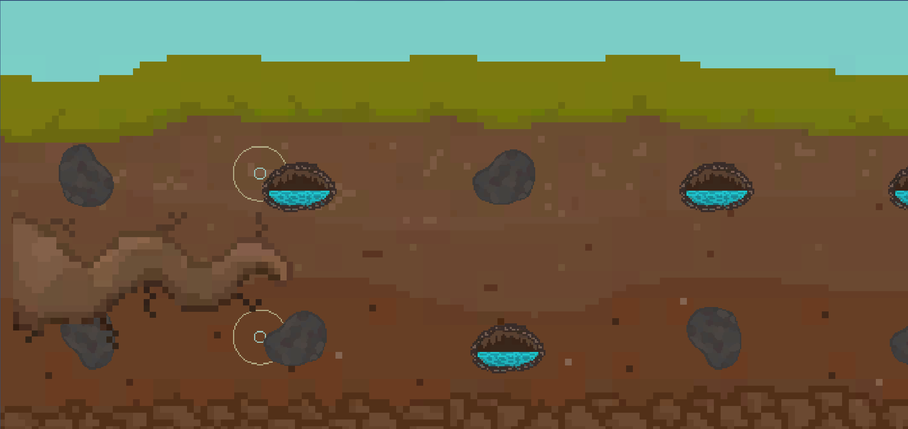

## 🍎 Description

**Symphony Root** is a rhythm-based game where you play as the root of an apple tree, navigating underground to find water while dodging rocks and other obstacles—all in sync with the music. Created for the [Global Game Jam 2023](https://v3.globalgamejam.org/2023/games/symphony-root-8), the game explores the theme of "Roots" in a playful and musical way.

### [🎮 Download and play Symphony Root on itch.io](https://deinigu.itch.io/symphony-root)

## 🦾 Credits

**Symphony Root** was developed in collaboration with:

- [Lucas Colbert Eastgate](https://www.linkedin.com/in/lucas-colbert-eastgate-140a911b3/)
- [Daniel de Lizaur García](https://www.linkedin.com/in/delizaur/)
- Guillermo Cervi Salmerón
