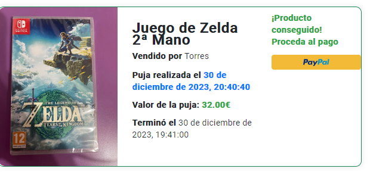

## 🔍 Project Overview

This application was developed as the final project made for the "Web Engineering" class.

_elRastro_ is a comprehensive application designed to facilitate the buying and selling of products, incorporating a bidding system. It is built on a microservices architecture, deployed in the cloud, and features functionalities such as user management, payments, and product visualization on a map.

- [🔗 Frontend GitHub Repository](https://github.com/Deinigu/elRastro-fe)
- [🔗 Backend GitHub Repository](https://github.com/Deinigu/elRastro-be)

---

## 🎯 Key Objectives

- **User Management:** Implementation of login and registration using Google OAuth 2.0.
- **Secure Payments:** PayPal integration for managing financial transactions.
- **Product and Bid Management:** Functionality to upload products, place bids, and automatically re-upload products without bids at a discount.
- **Map Visualization:** Displaying product locations on a map using Leaflet and OpenStreetMap.
- **Communication:** Messaging system for user conversations.

---

## 🛠 Technologies Used

| Category              | Tools                                                                            |
| :-------------------- | :------------------------------------------------------------------------------- |
| **Backend**           | Python, Django, Django REST Framework, pymongo, djongo, psycopg2                 |
| **Frontend**          | HTML, CSS, TypeScript, Angular (v17), ngx-paypal, angular-oauth2-oidc            |
| **Database**          | MongoDB (Atlas)                                                                  |
| **External Services** | OpenStreetMap, TimeZoneDB, FreecurrencyAPI, Cloudinary, Google OAuth 2.0, PayPal |
| **Version Control**   | Git, GitHub                                                                      |
| **Deployment**        | AWS EC2 (for microservices), Vercel (for frontend)                               |

---

## ✨ Application Flow & Key Features

The application is structured into several microservices for functionalities such as users, products, bids, carbon footprint, conversations, ratings, and images.

### Main features:

1.  **Google Login and Registration:** Users can securely register and log in using their Google accounts via OAuth 2.0.
2.  **PayPal Payment System:** Integration with the `ngx-paypal` library to facilitate payment for winning bids.
3.  **Smart Product Management:** Products that close their auction without bids are automatically re-uploaded with a 10% discount and an extended closing date by one week.
4.  **Interactive Product Map:** Visualization of all available products on a map, allowing users to see their location and access more information.
5.  **RESTful API:** A set of APIs for managing users, products, bids, ratings, and conversations, enabling communication between the different microservices.

---

## 🦾 Credits

This project was developed in close collaboration with an outstanding team:

- [Lucas Colbert Eastgate](https://www.linkedin.com/in/lucas-colbert-eastgate-140a911b3/)
- [Alba Sánchez Ibañez](https://www.linkedin.com/in/alba-s-093242259/)
- [Miguel Moya Castillo](https://www.linkedin.com/in/miguel-moya-castillo-07a0a7303/)
- [Fernando Calvo Díaz](https://www.linkedin.com/in/fernando-calvo-d%C3%ADaz-8808a1268/)

Their expertise, dedication, and teamwork were essential to the development of _elRastro_.
