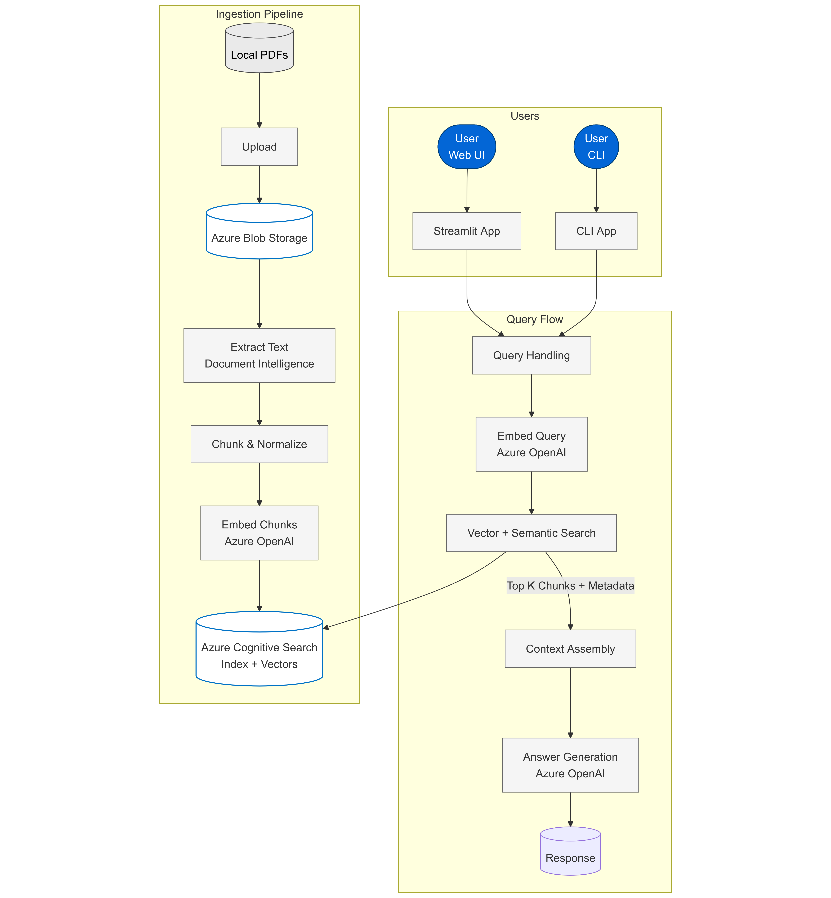

[🔗 GitHub Repository](https://github.com/Deinigu/videogame-assist-rag/)

A Retrieval-Augmented Generation (RAG) system built with Azure OpenAI and Azure Cognitive Search, featuring both console and web interfaces for document-based question answering about video game manuals and guides.

## 🚀 Features

- **📄 PDF Document Processing**: Automatically extracts and processes PDF documents using Azure Document Intelligence
- **🔍 Vector Search**: Uses Azure Cognitive Search with semantic search capabilities and text embeddings
- **💬 AI-Powered Chat**: Leverages Azure OpenAI GPT-4o-mini for intelligent responses
- **🌐 Web Interface**: Interactive Streamlit chat interface with conversation history
- **🖥️ Console Interface**: Command-line interface for quick interactions
- **📊 Analytics**: Chat statistics and export functionality
- **🔒 Secure**: Environment-based configuration with no hardcoded secrets
- **⚡ Smart Processing**: MD5 hash checking to avoid reprocessing unchanged documents

## 🏗️ Architecture

This RAG system combines several Azure services:

- **Azure OpenAI**: For text generation and embeddings
- **Azure Cognitive Search**: For vector search and document indexing
- **Azure Document Intelligence**: For PDF text extraction
- **Azure Blob Storage**: For document storage

