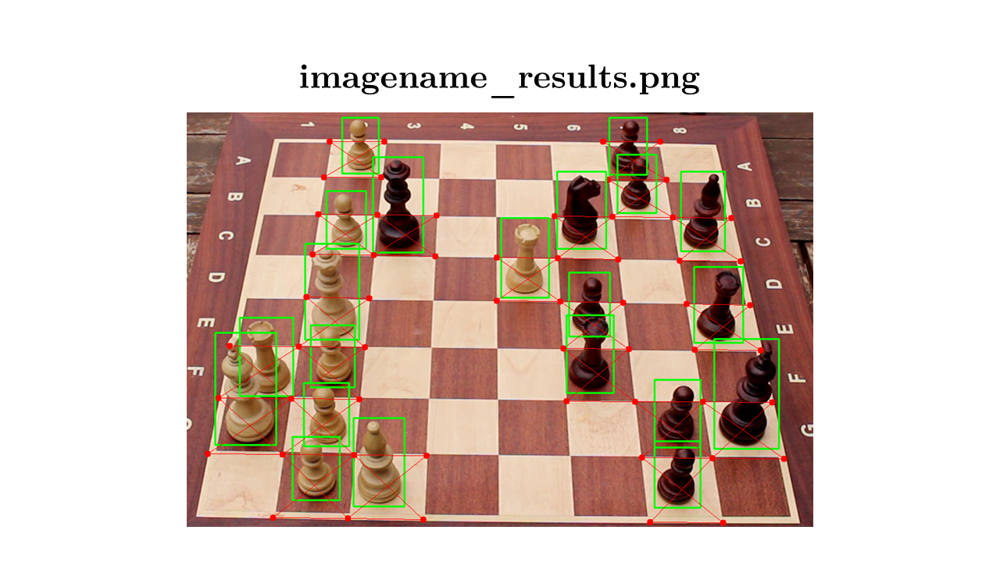

[🔗 GitHub Repository](https://github.com/Deinigu/TFG-Diego)

This project was done as my Final Degree Project for the University of Málaga.
The purpose of this project is to develop a neural network system that detects and classifies chess pieces on a real board, outputting their positions in FEN format. It uses a custom-labeled dataset and applies deep learning and computer vision techniques to ensure accurate performance under varying lighting conditions. The system aims to help digitize physical chess games for enthusiasts.

📖 You can read my Final Degree Project paper in [this Linkedin Post](https://www.linkedin.com/posts/dlreduello_tfg-activity-7222631442877472768-mZHz?utm_source=share&utm_medium=member_desktop&rcm=ACoAAEcYgbUBm3jHuqQll3I-uZcozZftcskZH0c).

---

## 📚 Table of Contents

---

## 🔍 Project Overview

This project focuses on automating the recognition of chessboard positions using **YOLOv8**, **OpenCV**, and a custom dataset. The output is provided in **Forsyth-Edwards Notation (FEN)** for seamless import into platforms like Lichess.

- Built for **chess players, streamers, and tournament digitization**
- Generates both **annotated images** and **FEN strings**
- Evaluated under **variable lighting and angles**

---

## 🎯 Goals

### 🎯 General Goal

Develop software that detects and classifies chess pieces on a real board image and outputs FEN.

### ✅ Specific Objectives

- Create a labeled dataset from real board photos.
- Train a deep learning model to detect/classify pieces.
- Detect the board grid via computer vision techniques.
- Map pieces to cells and produce FEN.
- Evaluate accuracy under different lighting and rotations.

---

## 🛠 Technologies Used

| Category          | Tools                            |
| ----------------- | -------------------------------- |
| Language          | Python                           |
| Deep Learning     | YOLOv8 (Ultralytics)             |
| Data Labeling     | CVAT                             |
| Vision Processing | OpenCV                           |
| Experiments       | Google Colab                     |
| Data Analysis     | Pandas, Matplotlib, SciPy        |
| IDE / Tooling     | Visual Studio Code, Git & GitHub |

---

## 📷 Dataset Creation


Due to the lack of publicly available datasets that suited the specific needs of my project, I decided to create my own. I used a camera to capture images of a chessboard placed in my yard, ensuring a variety of natural lighting conditions. Each image was then meticulously labeled manually, identifying every piece individually.

### Dataset Features

The resulting dataset has the following characteristics:

- **130 labeled images** from video frames (Canon EOS100D)
- Uniform angle (side-right view) for consistency
- Labeled using **CVAT**
- Distribution:
  - 90 training
  - 30 validation
  - 10 test (never seen during training)
    

### Example label:

```txt
// class_id center_x center_y width height
0 0.740893 0.358486 0.054505 0.187343
1 0.750341 0.468051 0.045786 0.155046
1 0.724542 0.215722 0.043604 0.139537
2 0.715820 0.157579 0.045057 0.129194
2 0.762695 0.564556 0.051599 0.144704
// (...)
10 0.339003 0.571662 0.050141 0.114991
```

### Class Index Table

| Index |  Class Name  |
| :---: | :----------: |
|   0   |  black-king  |
|   1   | black-bishop |
|   2   | black-knight |
|   3   |  black-rook  |
|   4   |  black-pawn  |
|   5   | black-queen  |
|   6   |  white-king  |
|   7   | white-bishop |
|   8   | white-knight |
|   9   |  white-rook  |
|  10   |  white-pawn  |
|  11   | white-queen  |

### References

For dataset labeling and move selection, the following sources were referenced for notable chess positions and games:

- _My 60 Memorable Games_ by Bobby Fischer
- [Top 10 best chess games of all time!](]https://lichess.org/study/aWqXZzW3)

These resources provided a diverse set of strategic examples to enhance the dataset's variety and realism.

---

## 🧠 Piece Classification


**Model:** YOLOv8 (via Ultralytics)

**Training config:**

```python
model.train(
  data='dataset.yaml',
  epochs=30,
  batch=-1,
  lr0=0.0001,
  lrf=0.01,
  plots=True
)
```

**Hardware:** NVIDIA Tesla T4 (via Google Colab)

**Validation:** 5-fold cross-validation  


---

## ♟️ Board Detection

Several classical algorithms were tested:

| Algorithm                        | Result                          |
| -------------------------------- | ------------------------------- |
| `findChessboardCorners` (OpenCV) | ❌ Detected only 6x6 boards     |
| Harris / Shi-Tomasi              | ❌ Noise from surrounding edges |
| Canny + Hough Transform          | ✅ Final choice                 |

### ✅ Final Approach

```python
# Canny edge detection with automatic threshold
def canny_edge(img, sigma=0.33):
  v = np.median(img)
  lower = int(max(0, (1.0 - sigma) * v))
  upper = int(min(255, (1.0 + sigma) * v))
  return cv2.Canny(img, lower, upper)

# Hough line detection
cv2.HoughLines(image, 1, np.pi / 180, 125)
```


---

## ✨ Application Flow

The core of the application follows a **multi-stage pipeline** that combines deep learning with classical computer vision to generate an accurate digital representation of a real chessboard.

### Step-by-Step Flow

1. **Model Loading**
   - Load a pretrained YOLOv8 model (`model.pt`).
   - If the model is not found, the system stops with a clear error message.

2. **Image Input & Validation**
   - Accept a `.jpg`, `.jpeg`, or `.png` image via CLI.
   - Ensure the image is tightly cropped around the board.

3. **Piece Detection & Classification**
   - YOLOv8 detects and classifies all pieces.
   - Output saved as `labels.txt` with piece type, confidence, and bounding box info.

4. **Preprocessing**
   - Convert image to grayscale.
   - Apply Gaussian blur to reduce noise.
   - Detect edges using **Canny edge detector**.

5. **Line & Corner Detection**
   - Apply **Hough Line Transform** to detect vertical and horizontal lines.
   - Calculate intersections = cell corners.

6. **Cell Grid Construction**
   - Group intersection points to reconstruct the 8x8 chessboard grid.
   - Assign each cell a board coordinate (e.g., e4, d5).

7. **Piece-to-Cell Assignment**
   - Match detected bounding boxes to nearest cell center.
   - Handle unassigned pieces using a column-shift strategy.

8. **FEN Generation**
   - Build a FEN string from the final board state.
   - Save FEN to a `.txt` file and display a Lichess URL with the position.

9. **Annotated Output**
   - Generate images showing:
     - Edge detection
     - Grid overlay
     - Final piece positions
   - Save all images in a timestamped results folder.

10. **Debug Mode**
    - Optional flag `--debug` shows intermediate images (grayscale, edges, etc.)

---

## ⚗️ Experiments & Evaluation

Two experimental phases were conducted:

### 📊 Phase 1: Basic Training

- Initial training to test model and pipeline

### 📈 Phase 2: Cross-Validation

- 5-fold split using `.yaml` configs
- Averaged metrics for generalization score

```python
for k in range(5):
  model.train(data=ds_yamls[k], ...)
  results[k] = model.metrics
```

## ✅ Results

## 📸 Image & Video Examples

### Example Output



### Lichess Output

### Video Demo
